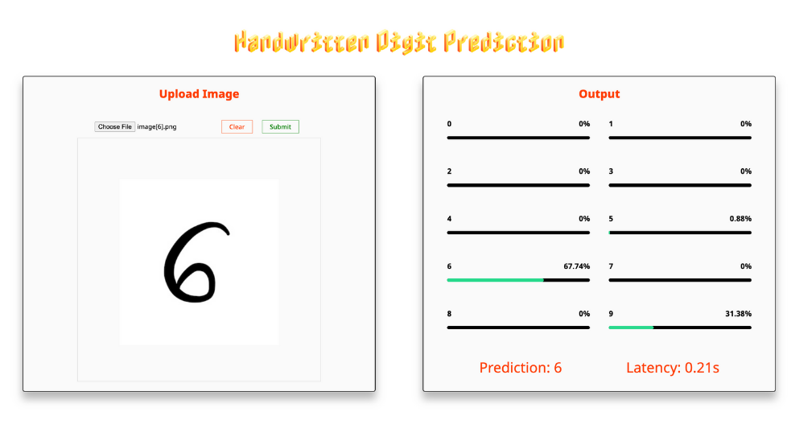

# Handwritten_Digit_Prediction_Web
  

## 👥 Team Members
* Minh Le
* Sophie Le
* An Cao

## ⭐ Description
* In our project, we delve into the realm of handwritten digit recognition, a fundamental task in the field of pattern recognition and machine learning. Our endeavor is motivated by the ubiquitous presence of handwritten digits in various domains, ranging from postal automation to financial document processing. The primary objective of our project is to develop a robust and accurate model capable of recognizing handwritten digits with high precision and reliability.

* To achieve this goal, we employ a novel approach of iterative model training. Rather than settling for a single training session, we iterate the training process multiple times, each iteration building upon the insights gained from the previous runs. This iterative training strategy allows us to continually refine and enhance the model's performance, pushing the boundaries of accuracy and reliability.

* Through rigorous experimentation and fine-tuning, we explore various hyperparameters, data augmentation techniques, and regularization strategies to optimize our model's performance. Additionally, we meticulously validate and test the model after each iteration, ensuring its ability to generalize well beyond the training data.

* The culmination of our efforts is a highly accurate and robust model capable of accurately recognizing handwritten digits across diverse datasets and real-world scenarios. By presenting our approach and findings, we aim to contribute to the advancement of handwritten digit recognition technology and its application in practical domains.

## 🌐 Web Screenshots

## ⭐ Features
* Handwritten Digit Prediction

## 💻 Tech Stacks

*  HTML 

*  CSS

*  Javascript

*  Django

*  Python